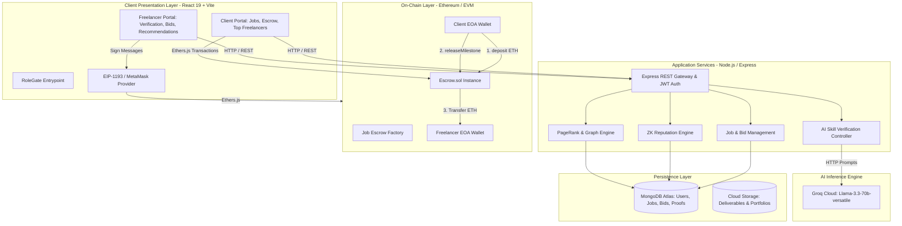
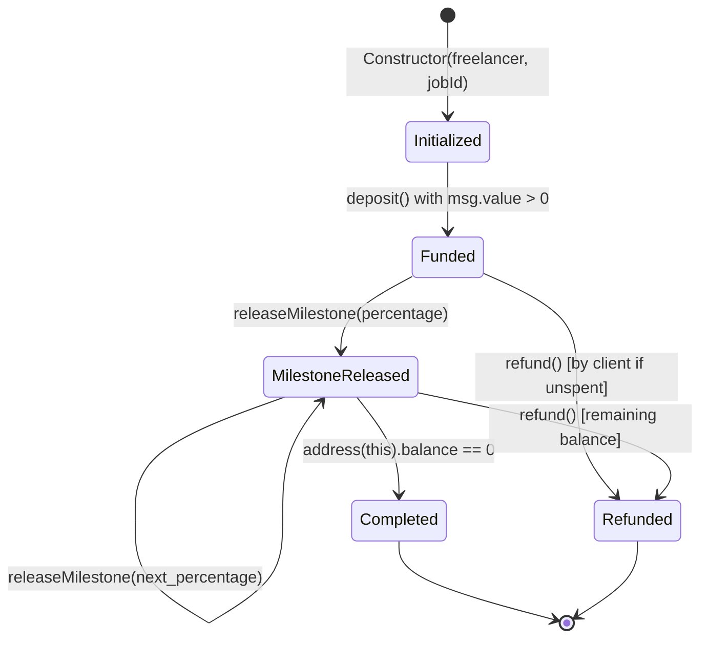
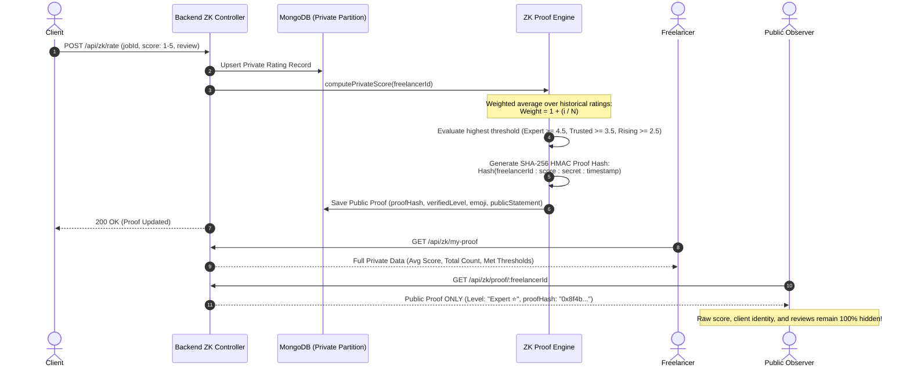
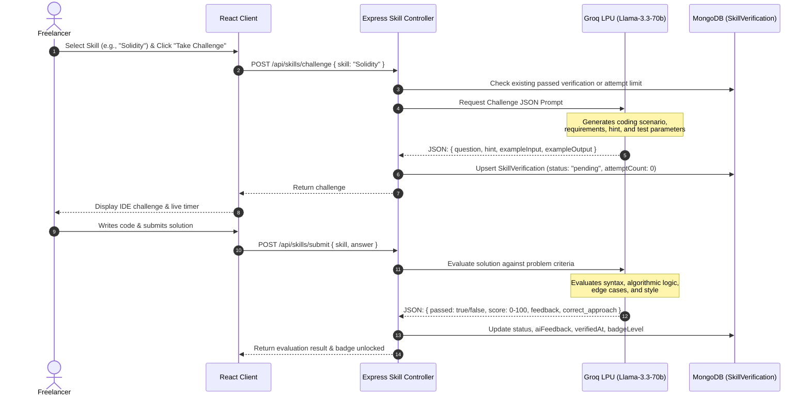
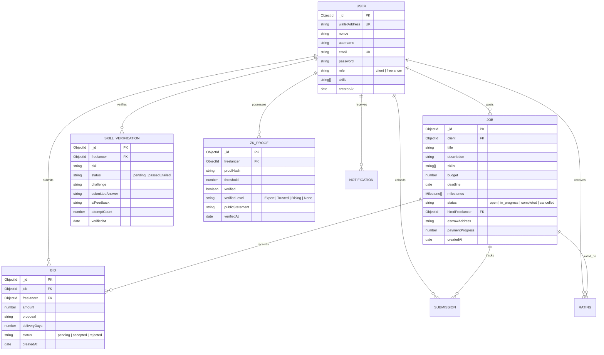

# System Architecture Document
## Project: FreeLance3 (Decentralized Web3 Freelance Platform)
**Document Version:** 1.0.0  
**Target Architecture:** Hybrid On-Chain / Off-Chain Microservices  

---

## 1. High-Level Architecture Overview

FreeLance3 utilizes a tiered architecture designed to isolate concerns, minimize on-chain transaction costs, preserve user privacy, and ensure maximum performance:

---

## 2. Smart Contract Escrow Architecture

Each hired engagement deploys or binds to an isolated instance of `Escrow.sol`. This guarantees non-custodial custody of funds without relying on platform treasury wallets.

### 2.1 Escrow State Machine

### 2.2 Contract Specification (`Escrow.sol`)
* **State Variables**:
  * `address public client`: Address with authority to deposit, release, and refund.
  * `address public freelancer`: Beneficiary recipient of milestone funds.
  * `uint256 public totalAmount`: Total ETH deposited upfront.
  * `uint256 public totalReleased`: Cumulative ETH transferred to freelancer.
  * `bool public isRefunded`: Flag preventing double refunds or releases post-cancellation.
  * `string public jobId`: Cross-reference string to MongoDB `Job._id`.
* **Methods**:
  * `deposit() external payable onlyClient notRefunded`: Locks funds upfront; requires `msg.value > 0` and `totalAmount == 0`.
  * `releaseMilestone(uint256 percentage) external onlyClient notRefunded`: Calculates `(totalAmount * percentage) / 100`, verifies `address(this).balance >= milestoneAmount`, updates `totalReleased`, and invokes safe low-level `.call{value: milestoneAmount}("")`.
  * `refund() external onlyClient notRefunded`: Empties remaining contract balance back to the client.
  * `getStatus()`: Returns full escrow state tuple for instant frontend reconciliation.
* **Security & Gas Profile**:
  * Adheres strictly to **Checks-Effects-Interactions** to prevent reentrancy attacks.
  * Reentrancy guard semantics embedded via state update preceding `.call`.
  * Typical deployment gas: ~340,000 gas; `releaseMilestone`: ~38,000 gas.

---

## 3. Cryptographic Zero-Knowledge (ZK) Reputation System

Traditional reviews suffer from **retaliation bias**, **private data leaks**, and **centralized censorship**. FreeLance3 employs a privacy-preserving cryptographic reputation protocol:

### 3.1 Reputation Tiers & Thresholds
| Tier Name | Minimum Score ($\tau$) | Visual Badge | Public Meaning | Trust Points Awarded |
| :--- | :---: | :---: | :--- | :---: |
| **Expert** | $\ge 4.5$ | ⭐ Gold | Exceptional top-tier delivery history | 40 pts |
| **Trusted** | $\ge 3.5$ | 🛡️ Emerald | Reliable, consistent high-quality execution | 28 pts |
| **Rising** | $\ge 2.5$ | 📈 Cyan | Early career momentum & validated delivery | 16 pts |
| **None** | $< 2.5$ | ◌ Neutral | New or unrated profile | 0 pts |

### 3.2 Performance & Benchmarks (from `measureProof.js`)
* **Sample Runs:** 1,000 iterations.
* **Proof Format:** 64-character hex SHA-256 digest (32 bytes binary).
* **Generation Latency:** $\approx 0.005\text{ ms}$ (under 6 microseconds), enabling instantaneous real-time recalculation upon every completed rating.

---

## 4. AI-Powered Skill Verification & Badging Pipeline

FreeLance3 eliminates credential fraud through automated, on-demand AI technical challenges powered by **Groq Cloud** running `llama-3.3-70b-versatile`.

### 4.1 Badging Logic & Multipliers
* **Gold Badge ($\ge 90$%)**: 3x multiplier in bipartite PageRank weight and $+3$ bonus in Trust Score.
* **Silver Badge ($75 - 89$%)**: 2x multiplier in PageRank and $+2$ bonus in Trust Score.
* **Bronze Badge ($60 - 74$%)**: 1x base weight.
* **Failure ($< 60$%)**: Increments `attemptCount`. Hard cap of 3 attempts per skill to prevent brute-force exploitation.

---

## 5. Bipartite Graph PageRank & Matching Engine

To prevent "pay-to-win" placement and discover genuine competence, FreeLance3 models the platform as a **bipartite directed graph** $G = (V, E)$:

### 5.1 Graph Definition
* **Vertices ($V$):**
  $$V = V_{\text{freelancers}} \cup V_{\text{skills}}$$
* **Edges ($E$):**
  * Directed edge from Freelancer $u$ to Skill $s$ with weight $W(u \to s) \in \{1, 2, 3\}$ corresponding to Bronze, Silver, or Gold badge.
  * Reverse directed edge from Skill $s$ to Freelancer $u$ with weight $0.5 \times W(u \to s)$ representing domain authority back-propagation.

### 5.2 PageRank Formulation
Iterative calculation over 20 cycles with damping factor $d = 0.85$:
$$PR^{(t+1)}(v) = \frac{1 - d}{|V|} + d \sum_{u \in \text{In}(v)} PR^{(t)}(u) \frac{W(u \to v)}{\sum_{w \in \text{Out}(u)} W(u \to w)}$$

### 5.3 Composite Talent Score Breakdown (0–100 Points)
For any client query with required skills $\{s_1, s_2, \dots, s_k\}$:
1. **Skill Match Score ($S_{\text{match}}$, Max 40 pts):**
   $$S_{\text{match}} = \min\left(40, \left(\frac{|\text{Matched Verified Skills}|}{k} \times 40\right) + 3 \cdot N_{\text{gold}} + 2 \cdot N_{\text{silver}}\right)$$
2. **ZK Reputation Score ($S_{\text{zk}}$, Max 30 pts):**
   * Expert: 30 pts | Trusted: 20 pts | Rising: 10 pts | None: 0 pts
3. **Platform Activity Score ($S_{\text{act}}$, Max 20 pts):**
   $$S_{\text{act}} = \min(20, \; 5 \times \text{JobsCompleted} + 1 \times \text{BidCount})$$
4. **PageRank Authority Score ($S_{\text{pr}}$, Max 10 pts):**
   $$S_{\text{pr}} = \min(10, \; PR(u) \times 1000)$$
5. **Total Score:**
   $$\text{Total Score} = S_{\text{match}} + S_{\text{zk}} + S_{\text{act}} + S_{\text{pr}}$$

---

## 6. Data Architecture & MongoDB Schemas

---

## 7. Security Architecture & Threat Mitigations

| Threat Vector | Attack Mechanism | FreeLance3 Defense / Mitigation |
| :--- | :--- | :--- |
| **Smart Contract Reentrancy** | Malicious freelancer contract recursively calling `releaseMilestone` during external call. | Checks-Effects-Interactions pattern adhered to in `Escrow.sol`; contract balance and `totalReleased` updated before external transfer. |
| **Escrow Drain by Unauthorized Actor** | Rogue address invoking `releaseMilestone` or `refund`. | Strict modifier `onlyClient` requiring `msg.sender == client`. |
| **Sybil Attack on Skill Verification** | Automated scripts spamming random code submissions to guess answers. | Hard cap of 3 attempts per skill (`attemptCount >= 3` check); AI evaluation checks semantic reasoning rather than literal substring match. |
| **Reputation Tampering** | Manipulating public reputation level in transit. | Public proof contains `proofHash = SHA256(freelancerId : score : secret : timestamp)`. Server-side HMAC validation prevents clients from spoofing tiers. |
| **Credential Hijacking** | Stealing session tokens. | JWT tokens signed with HS256 and stored in secure memory/session; passwords hashed with salted Bcrypt. Web3 auth uses random dynamic nonces to prevent replay attacks. |
