# Product Requirements Document (PRD)
## Project: FreeLance3 (Decentralized Web3 Freelance Platform)
**Document Version:** 1.0.0  
**Status:** Approved / Active Baseline  
**Target Platform:** Web (Desktop & Mobile Responsive)  

---

## 1. Executive Summary & Vision

**FreeLance3** is a next-generation decentralized freelance platform engineered to resolve the structural inefficiencies, exorbitant commission fees (15–20%), opaque reputation systems, and payment insecurity inherent in legacy freelance platforms like Upwork and Fiverr.

By synergizing **Ethereum smart contract escrow**, **privacy-preserving Zero-Knowledge (ZK) reputation scoring**, **LLM-driven skill verification via Groq (Llama-3.3-70b)**, and **PageRank-powered talent matching**, FreeLance3 creates a trustless, transparent, and fair economic marketplace for clients and independent contractors.

### Vision Statement
> *"To establish the open-source economic rails for global digital work—where reputation is verifiable yet private, work history is immutable, payments are guaranteed without intermediaries, and talent is matched through transparent algorithms rather than ad-sponsored placement."*

---

## 2. Problem Statement & Market Opportunity

| Problem in Traditional Platforms | Traditional Mechanism | FreeLance3 Innovation |
| :--- | :--- | :--- |
| **High Middleman Fees** | 10%–20% deducted from earnings + 3%–5% client processing fees. | Direct smart contract escrow with **0% platform fee** (only standard EVM network gas fees). |
| **Payment Insecurity & Chargebacks** | Clients can cancel work or trigger credit card chargebacks after completion; freelancers face delayed payouts. | Funds locked in **Ethereum Escrow Contract** upfront; deterministic milestone release with non-custodial safety. |
| **Subjective & Censored Reviews** | Negative reviews can be vindictive; platforms can de-platform freelancers, destroying years of social proof. | **Zero-Knowledge Reputation Proofs**: Verifiable tier claims (Expert, Trusted, Rising) cryptographically sealed without exposing private scores or client identities. |
| **Unverified Resume Inflation** | Anyone can list skills without proof, forcing clients to spend hours screening candidates. | **AI-Powered Dynamic Skill Challenges** (Groq Llama-3.3-70b) that generate and evaluate live coding & technical tests, issuing Gold/Silver/Bronze badges. |
| **Opaque Search Algorithms** | “Pay-to-promote” schemes and black-box SEO ranking favor platform profits over competence. | **Open Bipartite PageRank**: Graph algorithms that mathematically rank freelancers based on verified skill density, work history, and network authority. |

---

## 3. User Personas

### Persona A: Marcus (Web3 & Tech Client)
* **Demographics:** Founder of a DeFi protocol / Web3 startup, London, UK.
* **Pain Points:** 
  * Wastes weeks filtering through hundreds of unqualified applicants.
  * Fears paying developers upfront without guarantee of milestone deliverables.
  * Dislikes centralized platforms locking company accounts and charging heavy fiat conversion spreads.
* **Goals:**
  * Post project with clear milestones and deposit budget in ETH into smart contract escrow.
  * Filter top candidates using mathematical PageRank and AI-verified skill badges.
  * Review milestone deliverables and release partial or complete escrow funds in one click.

### Persona B: Elena (Senior Full-Stack & Smart Contract Developer)
* **Demographics:** Senior Freelance Engineer, Eastern Europe.
* **Pain Points:**
  * Upwork took 20% of her hard-earned income and can ban her profile at any time.
  * She cannot take her client feedback cross-platform.
  * Unfair clients leave arbitrary 1-star ratings that damage her overall profile rank.
* **Goals:**
  * Connect Web3 wallet (MetaMask / injected provider) and own her professional identity.
  * Prove she is an "Expert" tier developer cryptographically without disclosing private client feedback.
  * Take coding challenges to earn verified badges for Solidity, React, and Node.js.
  * Ensure her budget is securely escrowed before starting work.

---

## 4. User Journey & Core Workflows

### 4.1 Client Flow

### 4.2 Freelancer Flow

```mermaid
flowchart LR
    A[Visit RoleGate] --> B[Connect Wallet / Login]
    B --> C[Take AI Skill Challenge]
    C --> D[Earn Skill Badges Gold/Silver]
    D --> E[View Personalized Job Recommendations]
    E --> F[Submit Competitive Bid with Proposal]
    F --> G[Get Hired & Build Milestone Deliverables]
    G --> H[Upload Submission Artifact]
    H --> I[Receive ETH in Wallet & Update ZK Proof]
```

---

## 5. Functional Requirements (FR)

### 5.1 Authentication & Profile Management
* **FR-1.1 Multi-Mode Auth:** Support Web3 wallet signatures (nonce-based EIP-4361 / cryptographic challenge) and standard credentials (email/password with bcrypt hashing).
* **FR-1.2 Role Specialization:** Explicit role gating (`client` vs `freelancer`) with isolated dashboards, theme paletted navigation, and contextual action menus.
* **FR-1.3 Profile Customization:** Freelancers can specify headline, bio, portfolio links, hourly rates, and selected skills. Clients can maintain organization profile and job history.

### 5.2 Job Posting & Milestone Escrow Lifecycle
* **FR-2.1 Job Creation:** Clients specify title, rich description, required skill tags, total budget in ETH, delivery deadline, and structured milestones (percentage allocation totaling 100%).
* **FR-2.2 Smart Contract Escrow Deployment:** Upon freelancer selection, the client deploys a dedicated `Escrow.sol` contract instance bound to `(clientAddress, freelancerAddress, jobId)`.
* **FR-2.3 Fund Deposit:** Client deposits the full job budget in ETH to the escrow contract in a single transaction. Funds remain non-custodial and locked.
* **FR-2.4 Milestone Verification & Release:**
  * Freelancer uploads milestone deliverable files (stored in database/cloud storage) accompanied by completion notes.
  * Client inspects submission and calls `releaseMilestone(percentage)` on `Escrow.sol`.
  * The smart contract transfers the calculated ETH value directly to the freelancer's wallet address.
* **FR-2.5 Cancellation & Refund:** If a job fails before completion or upon mutual termination, the client can invoke `refund()` to reclaim unreleased ETH balances.

### 5.3 AI Skill Verification Engine (Groq Llama-3.3-70b)
* **FR-3.1 Dynamic Challenge Generation:** Freelancer requests verification for a specific skill (e.g., Solidity, React, Node.js, Python, TypeScript). Groq AI dynamically creates a bespoke coding challenge with question, hints, and expected test cases.
* **FR-3.2 Automated Code Evaluation:** Freelancer submits code solution. Groq evaluates correctness, edge case handling, and code quality, returning a structured JSON payload (`passed`, `score`, `feedback`, `correct_approach`).
* **FR-3.3 Tiered Badging:** 
  * Score $\ge 90$: **Gold Badge** (3x weight multiplier in PageRank and Trust score)
  * Score $75 - 89$: **Silver Badge** (2x weight multiplier)
  * Score $60 - 74$: **Bronze Badge** (1x weight multiplier)
* **FR-3.4 Anti-Abuse Rate Limiting:** Enforce a maximum of 3 attempts per skill. Failed attempts lock the test for a cooldown window.

### 5.4 Privacy-Preserving Zero-Knowledge (ZK) Reputation
* **FR-4.1 Private Rating Submission:** Upon job completion, client submits a score (1–5) and review. Raw scores are stored in a private partition.
* **FR-4.2 Time-Decayed Weighted Average:** Ratings are evaluated using a time-weighted function giving greater weight to recent performance:
  $$\text{Weight}_i = 1 + \left(\frac{i}{N}\right)$$
* **FR-4.3 Threshold Proof Generation:** The system computes whether the freelancer meets standard reputation thresholds:
  * **Expert:** Score $\ge 4.5$ (⭐ Gold status)
  * **Trusted:** Score $\ge 3.5$ (🛡️ Emerald status)
  * **Rising:** Score $\ge 2.5$ (📈 Cyan status)
* **FR-4.4 Zero-Knowledge Public Statement:** Public profiles expose only the cryptographic proof hash and the highest verified threshold level. Raw reviews, individual ratings, and client identities remain completely hidden.
* **FR-4.5 Freelancer Self-Audit:** Freelancers can view their own private rating metrics and threshold breakdown in their authenticated dashboard (`/freelancer/reputation`).

### 5.5 Graph-Based Talent Ranking & Recommendation Engine
* **FR-5.1 Bipartite Talent-Skill Graph:** Construct an interconnected graph where nodes represent freelancers and skills, and edges represent verified certifications weighted by badge tier (Gold = 3, Silver = 2, Bronze = 1).
* **FR-5.2 PageRank Authority Score:** Calculate iterative PageRank ($\alpha = 0.85$, 20 iterations) to discover network authority and cross-skill versatility.
* **FR-5.3 Composite Talent Ranking Formula:**
  $$\text{Composite Score} = \text{Skill Match (40 pts)} + \text{ZK Reputation (30 pts)} + \text{Activity (20 pts)} + \text{PageRank (10 pts)}$$
* **FR-5.4 Client Top Freelancers Leaderboard:** Interactive talent discovery page enabling clients to filter candidates by required skills, sort by trust score, and view matched capabilities.
* **FR-5.5 Smart Job Recommendations:** Algorithmic feed for freelancers recommending open jobs ranked by skill overlap with their verified badges.

### 5.6 Real-Time Notifications & Auditing
* **FR-6.1 Activity Stream:** In-app notifications for bid proposals, contract deployment, escrow deposits, milestone submissions, payment releases, and ratings.
* **FR-6.2 Live Platform Analytics:** Public platform telemetry (`/api/platform/stats`) displaying total freelancers, jobs posted, completed contracts, total ETH transacted, and verified skills.

---

## 6. Non-Functional Requirements (NFR)

### 6.1 Performance & Latency
* **NFR-1.1 API Response Time:** 95th percentile of non-LLM API responses under 150ms.
* **NFR-1.2 AI Evaluation Latency:** Groq inference and structured parsing under 3.5 seconds.
* **NFR-1.3 Client Load Time:** Initial Largest Contentful Paint (LCP) under 1.2s; client bundle optimized via Vite tree-shaking.

### 6.2 Security & Cryptography
* **NFR-2.1 Non-Reentrant Escrow:** `Escrow.sol` adheres to Checks-Effects-Interactions pattern for all ETH transfers.
* **NFR-2.2 Strict Access Control:** Modifiers `onlyClient` and state checks `notRefunded` safeguard contract state.
* **NFR-2.3 Secure Secret Management:** Cryptographic proof generation relies on server-side `ZK_SECRET` never leaked to client runtimes.
* **NFR-2.4 JWT Sanitization:** Authentication tokens signed with HS256, containing role and user claims, expiring after 7 days.

### 6.3 Reliability & Availability
* **NFR-3.1 Smart Contract Immutability:** Contracts deployed on EVM (Sepolia / Ethereum Mainnet / Arbitrum) with deterministic state.
* **NFR-3.2 Database Resilience:** MongoDB index optimization across `freelancer_1_skill_1` and foreign keys.

---

## 7. Metrics & Key Performance Indicators (KPIs)

1. **Volume of Value Locked (TVL):** Total ETH deposited into milestone escrow contracts.
2. **Dispute Rate:** Percentage of jobs requiring refunds or arbitration (Target: < 2%).
3. **Verification Velocity:** Percentage of active freelancers with $\ge 1$ AI-verified skill badge (Target: > 70%).
4. **Hiring Conversion:** Time elapsed from client job posting to successful escrow deposit (Target: < 48 hours).
5. **Repeat Client Retention:** Percentage of clients posting more than 2 jobs within 60 days.
