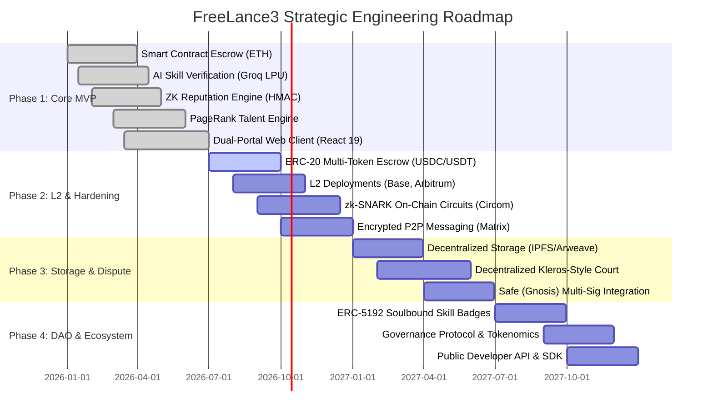

# Product & Engineering Roadmap
## Project: FreeLance3 (Decentralized Web3 Freelance Platform)
**Document Version:** 1.0.0  
**Planning Horizon:** 2026 – 2027  
**Status:** Approved Roadmap Baseline  

---

## 1. Strategic Roadmap Timeline



---

## 2. Phase Breakdown & Engineering Deliverables

### Phase 1: MVP Core Architecture (COMPLETED / CURRENT BASELINE)
*Objective: Build and validate the foundational Web3 freelancing rails with escrow payments, privacy-preserving reputation, and AI skill verification.*

* **Key Deliverables**:
  * [x] **Smart Contract Milestone Escrow (`Escrow.sol`)**:
    * Implemented in Solidity 0.8.28 with Hardhat 3 Beta.
    * Upfront budget locking (`deposit`), fractional percentage release (`releaseMilestone`), and client balance reclamation (`refund`).
    * Full unit test suite via Node.js native test runner (`node:test`) and Viem.
  * [x] **AI-Powered Skill Challenges**:
    * Groq Cloud integration with `llama-3.3-70b-versatile`.
    * Dynamic challenge generation and automated grading for Solidity, React, Node.js, Python, and TypeScript.
    * Tiered badging system (Gold $\ge 90$, Silver $\ge 75$, Bronze $\ge 60$) with 3-attempt anti-spam protection.
  * [x] **Zero-Knowledge Reputation Protocol**:
    * Private time-decayed rating calculations without exposing raw scores or client identities.
    * SHA-256 HMAC cryptographic threshold commitments (Expert $\ge 4.5$, Trusted $\ge 3.5$, Rising $\ge 2.5$).
    * Verification benchmark suite (`measureProof.js`) running under 6 microseconds per proof.
  * [x] **PageRank Talent Discovery & Matching**:
    * Mathematical bipartite graph algorithm linking freelancers and skills.
    * Multi-factor scoring ($40\%$ skill match, $30\%$ ZK proof, $20\%$ activity, $10\%$ PageRank).
    * Bidirectional recommendation feed for open jobs matching freelancer verified credentials.
  * [x] **Dual-Portal UI / UX**:
    * React 19, TailwindCSS v4, Vite 8, and custom design system (Client Purple vs Freelancer Blue).
    * `RoleGate` entrypoint with real-time particle canvas physics and live platform telemetry.

---

### Phase 2: Production Hardening, L2 Rollouts & zk-SNARKs (Q3 – Q4 2026)
*Objective: Reduce gas fees to under $0.05 per milestone release, introduce stablecoin payments, and upgrade cryptographic proofs to mathematically succinct zk-SNARKs.*

* **Deliverables**:
  1. **ERC-20 Multi-Token Escrow**:
     * Upgrade `Escrow.sol` to support standard ERC-20 tokens (USDC, USDT, DAI) using OpenZeppelin's `SafeERC20`.
     * Protect freelancers and clients from cryptocurrency volatility on long-term contracts.
  2. **Layer-2 Rollout**:
     * Deploy verified contracts on **Base** and **Arbitrum One**.
     * Drastic reduction of transaction costs (from $5–$20 on Ethereum L1 to $< $0.05 on L2).
  3. **Succinct On-Chain zk-SNARKs (Circom + SnarkJS)**:
     * Migrate server-side SHA-256 HMAC commitments to true mathematical Zero-Knowledge circuits.
     * Freelancers generate Groth16 / Plonk proofs proving their score meets threshold $\tau$ without revealing client signatures.
     * Deploy an on-chain `ZKVerifier.sol` contract validating proofs in $\sim 200,000$ gas.
  4. **Encrypted In-App P2P Messaging**:
     * End-to-end encrypted chat between client and hired freelancer using the Matrix protocol or WebRTC.
     * Prevents platform leakage while securing intellectual property communications.

---

### Phase 3: Decentralized Storage & Dispute Arbitration (Q1 – Q2 2027)
*Objective: Remove centralized file storage dependencies and introduce a trustless, decentralized court system for disputed contracts.*

* **Deliverables**:
  1. **Decentralized Deliverable Storage**:
     * Native integration with **IPFS** / **Filecoin** / **Arweave** via Pinata or Web3.Storage.
     * Milestone deliverable uploads hash files to IPFS CID (`ipfs://Qm...`), ensuring tamper-proof delivery records on-chain.
  2. **Decentralized Dispute Court (Kleros-Inspired)**:
     * If a client refuses milestone approval unfairly, the freelancer can initiate dispute arbitration.
     * Independent staked jurors examine milestone specifications and deliverable IPFS CIDs to vote on fund distribution.
     * Built-in economic incentives (jurors earn arbitration fees for honest consensus voting).
  3. **Enterprise Multi-Sig Support**:
     * Direct compatibility with **Safe** (formerly Gnosis Safe) multi-sig accounts for enterprise clients requiring $M$-of-$N$ signatures to post jobs or release funds.

---

### Phase 4: Soulbound Tokens (SBT) & Protocol DAO (Q3 2027+)
*Objective: Transition platform governance and verified credentials to decentralized, permanent on-chain standards.*

* **Deliverables**:
  1. **ERC-5192 Soulbound Skill Badges**:
     * Upon passing the Groq AI challenge with Gold/Silver status, freelancers can mint non-transferable Soulbound Badges directly to their wallet.
     * Provides an immutable, cross-platform verifiable on-chain resume recognized across the entire Web3 ecosystem.
  2. **Community Governance ($LANCE Token)**:
     * Decentralized Autonomous Organization (DAO) governing protocol parameter updates, dispute resolution rules, and AI verification curriculum.
     * Zero platform fees for native token stakers.
  3. **Public Developer SDK & REST/GraphQL API**:
     * Enable third-party Web3 talent directories and DAOs to embed FreeLance3 milestone escrow directly into their governance portals.

---

## 3. Engineering Risk Matrix & Mitigation Strategies

| Risk Description | Probability | Impact | Mitigation Strategy |
| :--- | :---: | :---: | :--- |
| **Smart Contract Exploit / Drain** | Low | Critical | Rigorous external audits by top Web3 security firms (OpenZeppelin / Trail of Bits); comprehensive fuzz testing using Foundry and Hardhat 3; bug bounty program. |
| **AI LLM Hallucination in Code Grading** | Medium | Moderate | Deterministic JSON schema enforcement; strict few-shot prompt guidelines; fallback heuristic parser; human re-evaluation appeal mechanism. |
| **L1 Gas Price Spikes** | High | High | Prioritize Layer-2 default deployments (Base & Arbitrum One) where milestone releases cost less than $0.05. |
| **Sybil Attackers Gaming PageRank** | Medium | Medium | Require verified skill badges (which have rate limits and attempt caps) or minimum completed escrow contracts to establish graph edge weights. |
| **Client Abandonment / Inactivity** | Medium | Moderate | Implement automated timelock clauses in `Escrow.sol`: if client fails to review a submitted milestone within 14 days, funds auto-release to the freelancer. |

---

## 4. Key Milestones & Release Acceptance Criteria

```
┌────────────────────────────────────────────────────────────────────────┐
│ MILESTONE CRITERIA CHECKLIST                                           │
├────────────────────────────────────────────────────────────────────────┤
│ [✓] Milestone 1.0 (Core Engine):                                      │
│     • Solidity Escrow tested on local EVM and Sepolia                  │
│     • Groq Llama-3.3-70b generating challenges in < 3.5s               │
│     • SHA-256 ZK threshold proofs generated in < 0.01ms                │
│     • Full dual-portal UI deployed on Vercel                           │
│                                                                        │
│ [ ] Milestone 2.0 (L2 Scaling & Multi-Token):                          │
│     • USDC & USDT escrow deployments on Base Sepolia                   │
│     • Gas per release < $0.05 equivalent                               │
│     • Circom zk-SNARK verifier contract integration                   │
│                                                                        │
│ [ ] Milestone 3.0 (Decentralized Integrity):                           │
│     • IPFS hash verification for all milestone uploads                 │
│     • Working decentralized dispute arbitration module                 │
│                                                                        │
│ [ ] Milestone 4.0 (Autonomous Network):                                │
│     • ERC-5192 Soulbound Badges minted on Base                         │
│     • DAO governance voting activated                                  │
└────────────────────────────────────────────────────────────────────────┘
```
